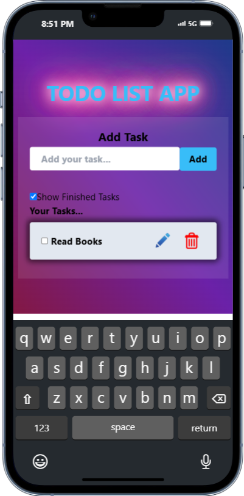

# Todo List App
 By, Subhadip Maity

## Description
A Todo List App is a simple application that helps users manage tasks they need to complete. This app allows users to add, view, delete, and edit tasks, making it easier to stay organized and track progress. The tasks are stored in local storage to maintain data even after the app is closed.

## Table of Contents
- [Installation](#installation)
- [Images](#images)
- [Usage](#usage)
- [Features](#features)
- [Technologies Used](#technologies-used)
- [Notes](#notes)
- [Contact](#contact)

## Installation
1. Clone the repository:
    ```bash
    git clone https://github.com/SontuCoder/ToDo_List.git
    ```
2. Navigate to the project directory:
    ```bash
    cd ToDo_List
    ```
3. Install dependencies:
    ```bash
    npm install
    ```
1. Start the development server:
    ```bash
    npm run dev
    ```

## Images
1. Add task:


2. In Desktop screen:


## Usage
1. Add tasks using the input field and view them in the list.
2. Use the delete button to remove tasks.
3. Edit tasks by clicking on the task text.
4. The tasks will be stored in local storage automatically.

## Features
- Add Tasks
- View Tasks
- Delete Tasks
- Edit Tasks
- Local Storage for Persistent Data

## Technologies Used
- Vite
- React
- Tailwind CSS

## Notes
Feel free to customize and improve the application.

## Contact
- Email: [subhadipmaity792@gmail.com](mailto:subhadipmaity792@gmail.com)
- GitHub: [SontuCoder](https://github.com/SontuCoder)


